# Turtleで図形を描こう！

では、まず以下のプログラムを打ち込み、`F5`ボタンを押しましょう。

sample1_1.hsp
```HSP
#include "turtle.as"

forward(200)
right(90)
forward(200)
```

すると以下のような実行結果になるはずです。


画面に亀が表示されて移動し、線を描画しましたね。

さて、早速プログラムを分解してみましょう。

まず一行目の `#include "turtle.as"` については今回は説明しません。この亀が使えるようにするおまじないのようなものだと認識してください。

次に `forward(200)` とありますね。`forward()` というものは英語で前進するということです。また、括弧の中に200という数字が与えられており、これは要するに200歩進むということです。ためしに `forward()` の括弧の中身を200から100へと変えて、再び `F5` ボタンを押してみてください。

sample1_2.hsp
```HSP
#include "turtle.as"

forward(100)
right(90)
forward(200)
```

すると以下のような実行結果になるはずです。


右に進む距離が半分になりましたね。このように括弧の中の数字を変えることで亀が進む距離を変えることができます。

次に `right(90)` と書かれていますね。この `right()` というのは亀の向きを右に回転します。また気づいている人もいると思いますが、括弧の中の角度だけ回転します。この場合は90°回転するので右に直角に曲がっていますね。

これと同様に `left()` という命令もあります。こちらは左に括弧の中の角度だけ回転します。つまり `right()` の逆バージョンですね。ためしに以下のプログラムを実行してみてください。

sample1_3.hsp
```HSP
#include "turtle.as"

forward(100)
leftt(90)
forward(200)
```

すると以下のような実行結果になるはずです。

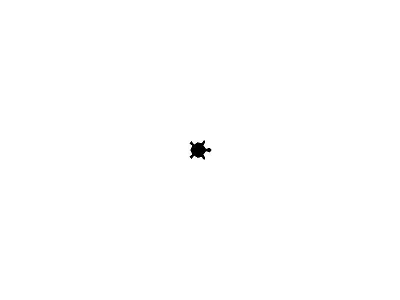

亀が左向きに90°回転しましたね。

それでは次のプログラムに移ります。

ではまず以下のプログラムを実行してみてください

sample2_1.hsp
```HSP
#include "turtle.as"

forward(200)
left(120)
forward(200)
left(120)
forward(200)
```

すると以下のような実行結果になるはずです。


正三角形が描かれましたね。

それではプログラムを分解してみましょう。

一行ずつ読んでいくと、

```
200歩進む
左に120°回転する
200歩進む
左に120°回転する
200歩進む
```

200歩というのは正三角形の辺の長さですね。

では120° というのはなんでしょうか？

これは小学5年生で習った「外角」というものです。

一直線である180° からそれぞれの角の角度を引いたものですね。

正三角形は内角(角の角度)が60° であるために左に180°- 60°= 120° 回転しました。

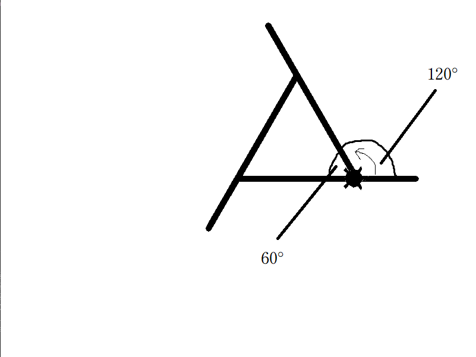

さて、それでは以下の `pencolor(red@)` という記述を追加してみてください。

sample2_2.hsp
```HSP
#include "turtle.as"

pencolor(red@)
forward(200)
left(120)
forward(200)
left(120)
forward(200)
```

すると以下のような実行結果になるはずです。


線の色が赤色になりましたね。

この `pencolor()` という命令は括弧の中に書かれた色へと線の色を変更するものです。色としては:
|  色   | 対応する記述 |
| :---: | :----------: |
| 赤色  |     red@     |
| 緑色  |    green@    |
| 青色  |    blue@     |
| 黒色  |    black@    |
| 白色  |    white@    |

が使えます。

次に三角形をもう少し大きく書いてみます。

以下のプログラムを実行してみてください。

sample2_3.hsp
```HSP
#include "turtle.as"

pencolor(red@)
right(90)
forward(200)
right(90)
forward(200)
right(180)
forward(400)
left(120)
forward(400)
left(120)
forward(400)
```

すると以下のような実行結果になるはずです。


<!--
先ほどよりも大きな正三角形が描かれましたね。少しおかしな部分は一度置いておいて、まずは新しい命令についてみていきましょう。

一つ目の新しい命令は `goto()` 命令です。`goto()` 命令は括弧内で指定した座標に移動する命令です。

皆さんは座標というものについて知っていますか？座標というものは小学５年生で習ったと思いますが、今回はそれをもう少し拡張します。

まず負の数というものをお教えしましょう。負の数とはズバリ0よりも小さい数です。では数直線を書いてみましょう。

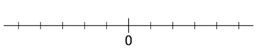

0が中心ですね。では正の数を書き込んでみましょう。

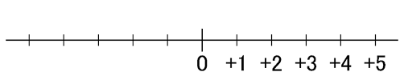

さて、ここで0よりも左の部分が負の数で、数字の前に `-` をつけて表します。

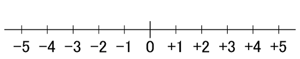

ではこれを座標にしてみましょう。

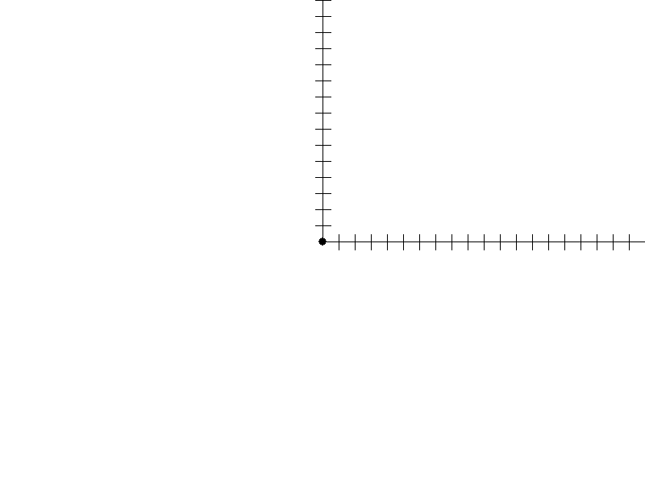

これを少し拡張してみます。
-->

先ほどよりも大きな正三角形が描かれましたね。しかし左下に移動するときに無駄な線が引かれてしまっています。さてこれを解消するには `penup()` と `pendown()` という命令を使います。以下のコードを実行してみて下さい。

sample2_4.hsp
```HSP
#include "turtle.as"

pencolor(red@)
penup
right(90)
forward(200)
right(90)
forward(200)
right(180)
pendown
forward(400)
left(120)
forward(400)
left(120)
forward(400)
```

すると以下のような実行結果になるはずです。


不要な線が引かれませんでしたね。さてそれでは新しい命令を見ていきましょう。`penup()` とはペンを上げるという意味で、つまり亀が動いても線を描かなくなります。`pendown()` という命令はその反対で、ペンを下ろして亀が動いたら線を描くようになります。

これを使い、三角形を描き始める前の最初の点に移動するときは線を描かず、三角形の最初の点についたらペンを下ろし、線を描けるようにします。

それでは皆さんも自分で作ってみましょう。お題は星型です。
以下のプログラムから始めて一辺が400の星形を描いてください。

```HSP
#include "turtle.as"

penup
left(90)
forward(100)
left(90)
forward(200)
left(180)
pendown
```

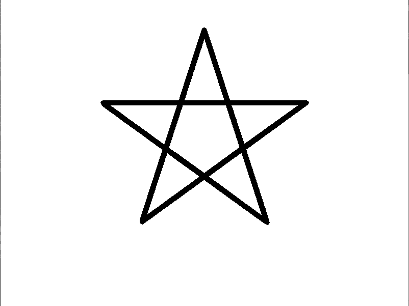

解答例は以下の通りです。

sample3_1.hsp
```HSP
#include "turtle.as"

penup
left(90)
forward(100)
left(90)
forward(200)
left(180)

pendown
forward(400)
right(144)
forward(400)
right(144)
forward(400)
right(144)
forward(400)
right(144)
forward(400)
```

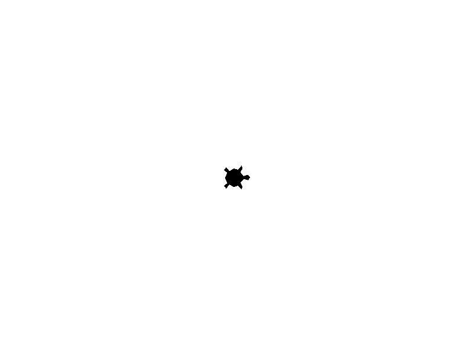

144°というのは星形のそれぞれの角が36°であるため、その外角が144°になるということですね。

実はこれはもう少し短く書くことができます。なぜならばこのコードでは `forward(400)` と `right(144)` が複数回使われています。これを繰り返し処理としてまとめることができます。以下のプログラムを実行してみてください。

```HSP
#include "turtle.as"

penup
left(90)
forward(100)
left(90)
forward(200)
left(180)

pendown
repeat 5
	forward(400)
	right(144)
loop
```

先ほどとほぼ同じ実行結果になるはずです。

この `repeat` ～ `loop` という構文は `repeat` 命令の後に指定された数の回数だけ `repeat` ～ `loop` の間に書かれているプログラムを実行します。ここでは 
```HSP
forward(400)
right(144)
```
を5回実行するということですね。

では説明は以上となります。あとは各々好きな図形を描いてみてください。いくつかヒントとなる図形を示します。

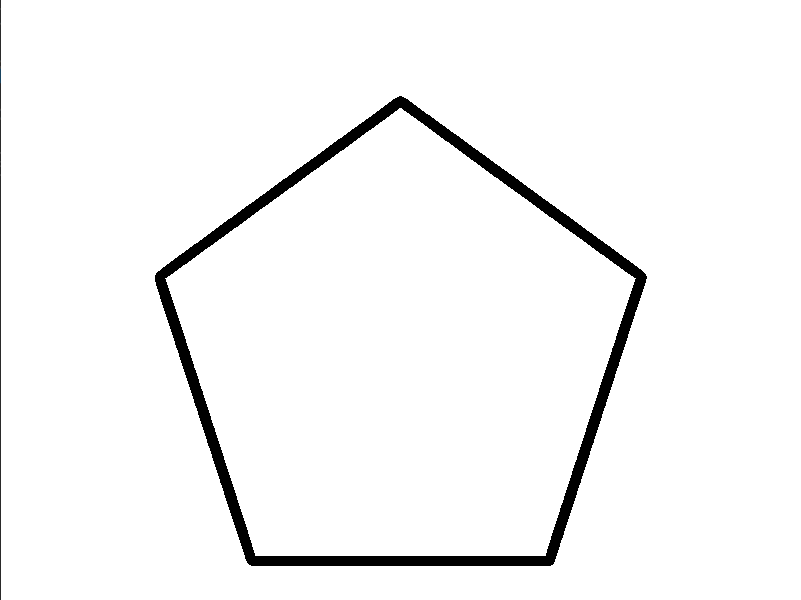

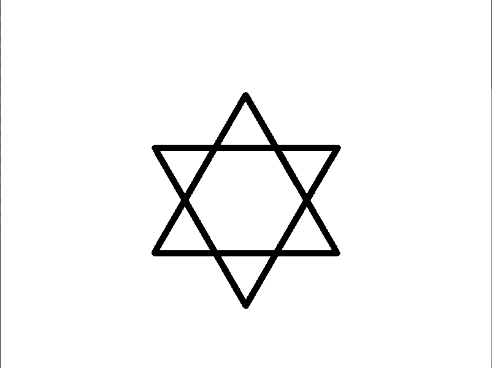

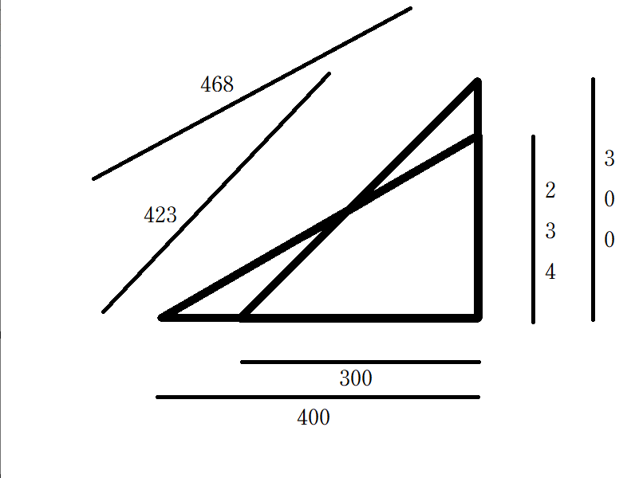